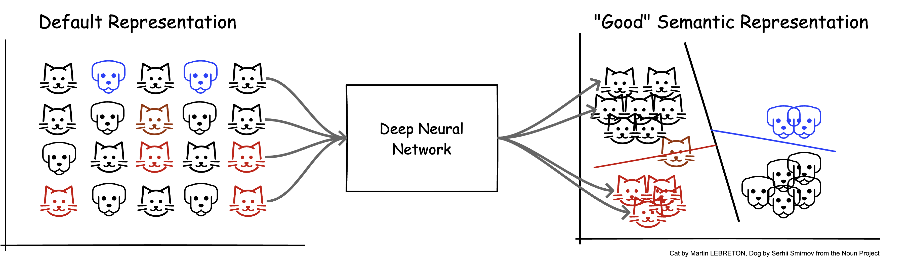
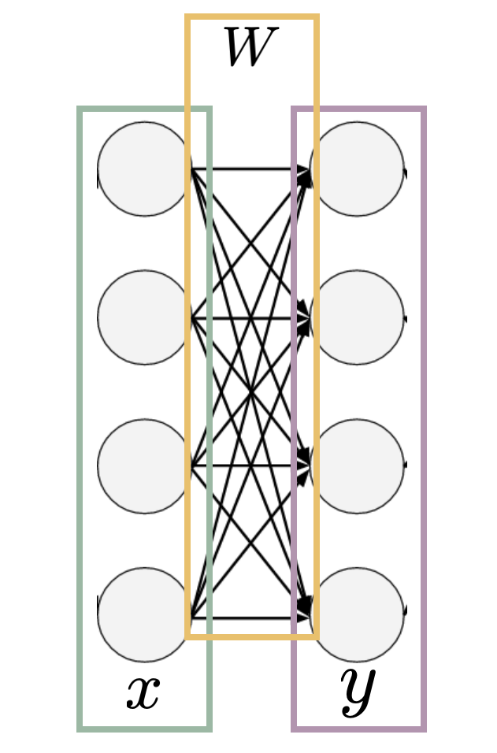
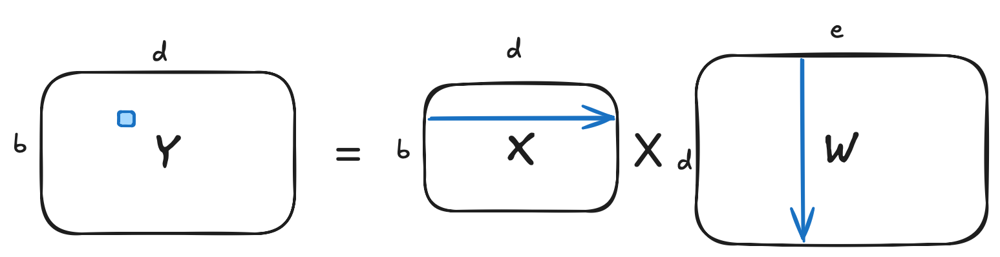

<style>
img[alt~="center"] {
  display: block;
  margin: 0 auto;
}
a[href='red'] {
  color: red;
  pointer-events: none;
  cursor: default;
  text-decoration: none;
}
.shared-weight-table {
  width: 88%;
  margin: 0 auto 12px;
  font-size: 24px;
  text-align: center;
}
.shared-weight-table th,
.shared-weight-table td {
  padding: 7px 12px;
  text-align: center;
  vertical-align: middle;
}
.shared-weight-cell {
  min-width: 170px;
  background: #eef6ff;
  border-left: 4px solid #2f80ed !important;
  border-right: 4px solid #2f80ed !important;
  color: #0f5e9c;
  font-size: 28px;
  font-weight: 700;
}
.shared-weight-cell span {
  color: #5d7185;
  font-size: 17px;
  font-weight: 500;
}
.callout {
  border-left: 6px solid #2f80ed;
  background: #eef6ff;
  padding: 12px 20px;
  margin-top: 18px;
}
.small {
  font-size: 25px;
}
.compact-title h1 {
  font-size: 48px;
}
footer {
  color: #738695;
  font-size: 16px;
}
</style>


# **大语言模型基础：从零到一实现之路**

第2讲：特征空间的变换

模型如何前向执行

---

# 今天只回答一个问题

> 一个模型，在计算机里究竟是怎样运行的？

<div class="callout">

**输入 Tensor → 执行 forward → 输出 Tensor**

</div>

<div data-marpit-fragment>

本节课先理解“如何计算”；下一节课再讨论“如何学习”。

</div>

---

# PyTorch 用 `forward` 描述模型计算

```python
class Model(nn.Module):
    def __init__(self):
        super().__init__()
        self.layer = ...       # 模型包含什么

    def forward(self, x):
        h = self.layer(x)      # 输入如何流动
        y = ...
        return y               # 返回输出 Tensor

model = Model()
y = model(x)                  # 触发 forward
```

<!-- [Sources]
https://docs.pytorch.org/docs/stable/generated/torch.nn.Module.html
-->

---

# 从数据中学习表示



- 设定任务目标
- 收集样本与标签
- 将现实对象表示为特征
- 学习从输入表示到目标表示的变换

<div data-marpit-fragment>

$$Y=f(X;\theta)$$

$\theta$ 是模型中需要学习的参数。

</div>

---

<!-- _class: compact-title -->

# 前向过程就是一个<br>对输入张量进行计算的程序

```text
输入 X
  ↓
算子 f₁(X; θ₁)
  ↓
中间表示 H
  ↓
算子 f₂(H; θ₂)
  ↓
输出 Y
```

<div class="callout" data-marpit-fragment>

模型可以很复杂，但每一步仍然只是 **Tensor → Tensor**。

</div>

---

# 线性层：空间变换



$$Y=XW+b$$

- $X$：输入特征
- $W,b$：模型参数
- $Y$：新的特征表示
- $D\rightarrow E$：最后一个特征维度发生变化

---

# 用形状描述一次前向计算

$$
X\in\mathbb{R}^{B\times H\times D},\qquad
W\in\mathbb{R}^{D\times E}
$$

$$
Y=XW\in\mathbb{R}^{B\times H\times E}
$$

| 维度 | 含义 |
|---|---|
| $B$ | batch：同时处理的样本数 |
| $H$ | 额外结构维：位置、对象或序列 |
| $D$ | 输入特征维度 |
| $E$ | 输出特征维度 |

---

# 每个位置不同，但使用同一个 $W$

<table class="shared-weight-table">
  <thead>
    <tr><th>位置</th><th>输入向量</th><th>共享参数</th><th>输出向量</th></tr>
  </thead>
  <tbody>
    <tr><td>(0,0)</td><td><code>X[0,0,:]</code></td><td rowspan="4" class="shared-weight-cell"><i>W</i><br><small>[D,E]</small><br><span>同一个 Parameter</span></td><td><code>Y[0,0,:]</code></td></tr>
    <tr><td>(0,1)</td><td><code>X[0,1,:]</code></td><td><code>Y[0,1,:]</code></td></tr>
    <tr><td>(0,2)</td><td><code>X[0,2,:]</code></td><td><code>Y[0,2,:]</code></td></tr>
    <tr><td>(1,0)</td><td><code>X[1,0,:]</code></td><td><code>Y[1,0,:]</code></td></tr>
  </tbody>
</table>

$$Y[b,h,:]=X[b,h,:]W,\qquad \forall b,h$$

<div class="callout" data-marpit-fragment>

输入随位置变化；$W$ 不随 $b,h$ 变化，也不会为每个位置创建一份参数。

</div>

---

# 偏置 $b$ 引出另一种“复用”

<!-- _footer: "Notebook → 第 5 节｜高维输入与参数共享" -->

$$Y=XW+b$$

```python
xw = x @ w   # [B, H, E]
b  = ...     #       [E]
y  = xw + b  # [B, H, E]
```

<div data-marpit-fragment>

PyTorch 让同一个 $b[E]$ 沿 $B,H$ 维参与每个位置的加法，这就是 **broadcasting**。

</div>

<div class="callout" data-marpit-fragment>

$W$：参数共享下的批量线性变换；$b$：通过 broadcasting 参与逐元素运算。

</div>

---

# 矩阵乘：线性变换



$$
y_{bhe}=\sum_{d=1}^{D}x_{bhd}w_{de}
$$

- 每个输出元素是一个点积
- 总计算量约为 $O(BHDE)$
- 矩阵乘是深度学习最主要的计算来源之一

---

# Tensor 同时携带数据与计算属性

```python
x = torch.randn(
    2, 3, 4,
    dtype=torch.float32,
    device="cpu",
)
```

- `shape`：数据如何组织
- `dtype`：每个元素如何表示
- `device`：计算在哪里执行
- `requires_grad`：是否需要追踪梯度

后续所有模型组件，输入、输出和参数最终都是 Tensor。

---

# 先区分三类常见乘法

```python
# 矩阵乘：收缩相邻维度
y = x @ w

# 对应元素相乘：shape 相同或可广播
z = x * scale

# 批量矩阵乘
o = torch.bmm(q, k)
```

<div class="callout" data-marpit-fragment>

读代码时先问：输入和输出的 shape 是什么？各个维度如何变化？

</div>

---

# Broadcasting 的三条兼容规则

比较两个 Tensor 的 shape 时：

- **从最后一个维度向前对齐**
- 对应维度要么大小相等；要么其中一个为 `1`，可以沿该维重复使用
- 较短 Tensor 缺失的前导维度视为 `1`

```text
   [B, H, E]
+        [E]
-------------
   [B, H, E]
```

---

# 例 1：`[B,H,E] + [E]`

令 $B=2,H=2,E=3$：

```text
x[0] = [[ 1,  2,  3], [ 4,  5,  6]]
x[1] = [[ 7,  8,  9], [10, 11, 12]]
b    = [10, 20, 30]                    # [E]

对齐： [2, 2, 3] + [1, 1, 3]
b 沿 B、H 维重复使用后：
y[0] = [[11, 22, 33], [14, 25, 36]]
y[1] = [[17, 28, 39], [20, 31, 42]]
```

$$y_{bhe}=x_{bhe}+b_e$$

同一个向量 $b$ 被加到每一个 $(b,h)$ 位置。

---

# 例 2：`[B,H,E] * [H,1]`

仍令 $B=2,H=2,E=3$：

```text
scale = [[ 10], [100]]                 # [H, 1]

对齐： [2, 2, 3] * [1, 2, 1]
展开： [2, 2, 3] * [2, 2, 3]

y[0] = [[ 10,  20,  30], [ 400,  500,  600]]
y[1] = [[ 70,  80,  90], [1000, 1100, 1200]]
```

`10` 作用于每个 batch 的第 0 行，`100` 作用于第 1 行，并沿 $E$ 维重复使用。

---

# 用 shape 判断能否广播

<!-- _footer: "Notebook → 第 8 节｜运行两个 Broadcasting 例子" -->

| 运算 | 对齐过程 | 结果 |
|---|---|---|
| `[B,H,E] + [E]` | `[B,H,E] + [1,1,E]` | `[B,H,E]` |
| `[B,H,E] * [H,1]` | `[B,H,E] * [1,H,1]` | `[B,H,E]` |
| `[B,H,E] + [D]` | $E\ne D$ | 报错 |

<div class="callout" data-marpit-fragment>

先从右向左补齐维度，再逐维检查“相等或为 1”。

</div>

---

# einsum 把维度关系写进代码

$$Y_{bhe}=\sum_d X_{bhd}W_{de}$$

```python
B, H, D, E = 2, 3, 4, 5
x = torch.randn(B, H, D)
w = torch.randn(D, E)

y = torch.einsum("bhd,de->bhe", x, w)
assert y.shape == (B, H, E)
```

`b`、`h`、`e` 被保留，`d` 只在输入中出现，因此沿 `d` 求和。

---

# 参数也是 Tensor，但需要被模型管理

```python
w = nn.Parameter(torch.empty(D, E))
b = nn.Parameter(torch.zeros(E))
```

普通 Tensor 变成 `Parameter` 后：

- 会被模块自动注册
- 会出现在 `model.parameters()` 中
- 会随 `model.to(device)` 移动
- 会进入 `state_dict()`，从而保存和加载

---

# 用 `nn.Module` 写一个真实可用的模块

```python
class FeatureTransform(nn.Module):
    def __init__(self, in_dim, out_dim):
        super().__init__()
        self.weight = nn.Parameter(
            torch.empty(in_dim, out_dim)
        )
        self.bias = nn.Parameter(torch.zeros(out_dim))
        nn.init.xavier_uniform_(self.weight)

    def forward(self, x):
        return x @ self.weight + self.bias
```

<!-- [Sources]
https://docs.pytorch.org/docs/stable/generated/torch.nn.Module.html
https://docs.pytorch.org/docs/stable/generated/torch.nn.parameter.Parameter.html
-->

---

# Module 定义“状态 + 前向规则”

| `__init__` | `forward` |
|---|---|
| 创建参数 | 接收输入 |
| 创建子模块 | 组合 Tensor 运算 |
| 注册状态 | 返回输出 |

<div class="callout" data-marpit-fragment>

一个 PyTorch 模型，本质上是由多个 `nn.Module` 递归组合而成。

</div>

---

# 用 `model(x)` 触发 `forward`

```python
layer = FeatureTransform(4, 5)
x = torch.randn(2, 3, 4)

y = layer(x)            # 推荐
# y = layer.forward(x)  # 不推荐

print(y.shape)          # torch.Size([2, 3, 5])
```

`layer(x)` 会经过 `nn.Module.__call__`，在内部调用 `forward()`，同时保留 hooks、Autograd 等框架能力。

<!-- [Sources]
https://docs.pytorch.org/docs/stable/generated/torch.nn.Module.html
-->

---

# `nn.Linear` 采用另一种权重布局

| 实现 | 权重形状 | 前向公式 |
|---|---:|---|
| 本课/A0 `ManualLinear` | `[D, E]` | `X @ W` |
| PyTorch `nn.Linear` | `[E, D]` | `X @ weight.T + bias` |

```python
linear = nn.Linear(D, E)
y1 = linear(x)
y2 = x @ linear.weight.T + linear.bias

assert torch.allclose(y1, y2)
```

数学操作一致，区别只是参数的存储布局。

---

# Linear 只改变最后一个维度

<!-- _footer: "Notebook → 第 9–11 节｜FeatureTransform 与 nn.Linear" -->

```python
layer = nn.Linear(20, 30)

x = torch.randn(2, 8, 20)
y = layer(x)

print(y.shape)  # [2, 8, 30]
```

$$
[\ldots,D]\xrightarrow{\text{Linear}(D,E)}[\ldots,E]
$$

前面的 batch、序列、空间或对象维都被保留。

---

# 多个 Module 可以继续组合

```python
class TinyMLP(nn.Module):
    def __init__(self, dim, hidden_dim):
        super().__init__()
        self.up = nn.Linear(dim, hidden_dim)
        self.act = nn.ReLU()
        self.down = nn.Linear(hidden_dim, dim)

    def forward(self, x):
        h = self.up(x)
        h = self.act(h)
        return self.down(h)
```

`TinyMLP` 自身是 Module，内部又包含三个子 Module。

---

# 多层 Linear 仍是线性变换

$$Y=(XW_1)W_2=X(W_1W_2)$$

| 代码 | 表达能力 |
|---|---|
| `linear2(linear1(x))` | 仍然是线性变换 |
| `linear2(relu(linear1(x)))` | 能够表达非线性关系 |

<div data-marpit-fragment>

后面的 FFN、GELU、SwiGLU 都是在扩展这条思路。

</div>

---

# 模型也可以出现分支与残差

<!-- _footer: "Notebook → 第 12–13 节｜组合、非线性与残差" -->

```python
class ResidualBlock(nn.Module):
    def __init__(self, dim):
        super().__init__()
        self.mlp = TinyMLP(dim, 4 * dim)

    def forward(self, x):
        return x + self.mlp(x)
```

```text
      ┌──→ TinyMLP ──┐
X ────┤              ├──→ Y
      └──────────────┘
```

模型不一定是一条直线，但仍然是由 Tensor 运算构成的有向无环图。

---

# `nn.Module` 让代码更接近真实模型

```python
model = ResidualBlock(dim=128)

print(model)
print(dict(model.named_parameters()).keys())

model = model.to("cuda")
torch.save(model.state_dict(), "model.pt")
```

`nn.Module` 统一管理：

```text
参数注册 · 子模块 · 设备迁移 · 状态保存 · 前向调用
```

---

# A0 会故意拿掉框架的“自动挡”

| 课堂中的工程写法 | A0 中的手写写法 |
|---|---|
| `class Layer(nn.Module)` | `class ManualLinear` |
| `forward()` 定义计算 | `forward()` 显式保存输入 |
| Autograd 自动反向 | `backward(g)` 手工计算 |

<div class="callout" data-marpit-fragment>

先学会开“自动挡”，再通过 A0 拆开它，理解框架替我们完成了什么。

</div>

<!-- [Sources]
https://njudeepengine.github.io/LLM-Blog/2025/06/10/A0-onboarding/
-->

---

# 本节课建立的前向视角

```text
模型 = 对输入张量进行计算的参数化程序

nn.Module = 状态 + 子模块 + forward

forward = 输入 Tensor → 输出 Tensor
```

<div class="callout" data-marpit-fragment>

下一课：给定一个标量 Loss，梯度如何沿这张计算图反向传播？

</div>
