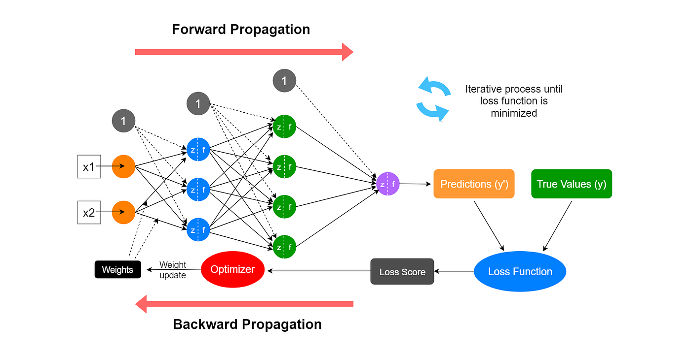
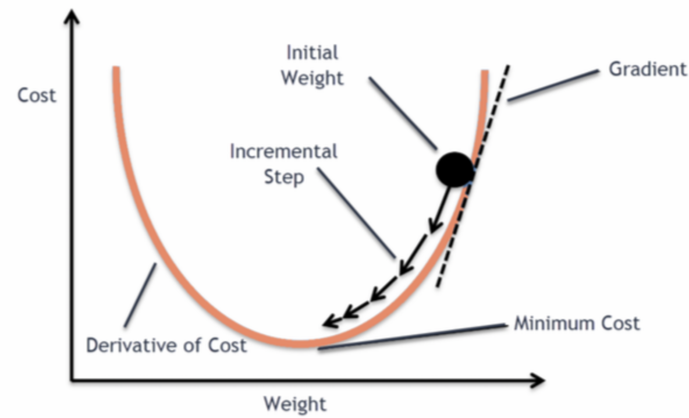
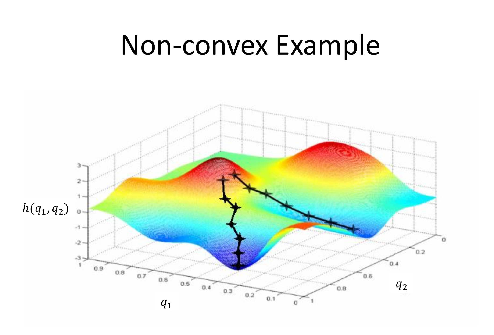
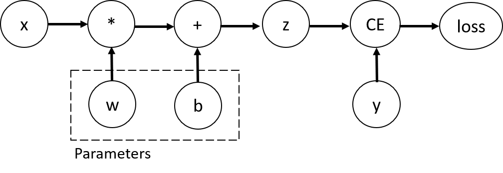

<style>
section.compact.a0 { font-size: 26px; padding-top: 40px; padding-bottom: 40px; }
section.a0 mjx-container[display="true"] { margin: 0.45em 0; }
section.compact { font-size: 28px; padding: 50px 60px; }
section.compact h1 { margin-bottom: 24px; }
section.compact p, section.compact ul { margin-top: 12px; margin-bottom: 12px; }
section.compact table { font-size: 26px; }

img[alt~="center"] {
  display: block;
  margin: 0 auto;
}
a[href='red'] {
    color: red;
    pointer-events: none;
    cursor: default;
    text-decoration: none;
}
</style>


# **大语言模型基础：从零到一实现之路**

第3讲: 特征空间的变换2
前反向运行视角理解深度学习模型

<!-- https://marp.app/ -->

---

# 反向传播：深度学习的关键

* 前向传播：从输入到输出，计算预测结果
* 反向传播：从输出到输入，计算梯度；优化器再根据梯度更新参数
* 核心思想：通过链式法则计算复合函数的导数

---



---

# 为什么需要反向传播？

* **目标**：找到使损失函数最小的参数
* **方法**：梯度下降，需要计算损失函数对每个参数的梯度
* **挑战**：深度学习模型是复合函数，直接计算梯度困难
* **解决**：反向传播算法，高效计算所有参数的梯度

---

<!-- _class: compact -->
### 模型的训练/学习
<!--  -->

* 假设，构建模型$f$，其参数为$\theta$
* 目标: 设计一种可用来度量基于$\theta$的模型预测结果和真实结果差距的度量，差距越小，模型越接近需估计的函数$f^*$
  * $J(\theta)=\frac{1}{n}\sum_{X\in \mathcal{X}}(f^*(X)-f(X;\theta))^2$
* 学习方法：梯度下降，寻找合适的$\theta$ (被称之**训练模型**)
<div style="display:contents;" data-marpit-fragment>


</div>


---

<!-- _class: compact -->
# 模型的训练/学习

* 目标: $J(\theta)=\frac{1}{n}\sum_{X\in \mathcal{X}}(Y-f(X;\theta))^2$

<div style="display:contents;" data-marpit-fragment>

1. 猜个$\theta$, 根据输入$X$，计算$\hat{Y}=f(X;\theta)$
2. 评估误差: $Y$和$\hat{Y}$的误差(loss)
3. 根据误差，更新$\theta$: $\theta=\theta -\lambda\cdot\Delta\theta$


</div>

---




---

<!-- _class: compact -->
# 训练模型(搜索/开发参数)

优化目标: $J(\theta)=\frac{1}{n}\sum_{X\in \mathcal{X}}(f^*(X)-f(X;\theta))^2$

梯度下降法 (Gradient descent): 求偏导(partial derivative)
* $f^*(X)$通常以真值(groundtruth)体现，因此$\frac{\partial}{\partial \theta}J(\theta)$重点关注$f(X;\theta)$
  * $f(X)=XW$ --> $\frac{\partial}{\partial \theta}f(X)=\frac{\partial}{\partial \theta}(XW)$
  * 通常深度学习模型$f(X)$为复合函数，可利用链式法则求偏导

* 核心算法: 反向传播(backpropagation)
  * 核心步骤: 针对优化目标$J(\theta)$按层“回退”，一层一层求偏导


---

<!-- _class: compact -->
# 反向传播(backpropagation)

* 假设深度学习模型为$f(X)=XW$的复合函数
  * $y=f_3(f_2(f_1(X)))$
* 优化目标$J(\theta)$的偏导$\frac{\partial}{\partial \theta}J$的核心为$\frac{\partial}{\partial \theta}y=\frac{\partial}{\partial \theta}f_3(f_2(f_1(X)))$
* 链式法则展开:
  * $\frac{\partial J}{\partial \theta_{f_1}} = \frac{\partial J}{\partial y}\cdot \frac{\partial y}{\partial f_3}\cdot \frac{\partial f_3}{\partial f_2}\cdot \frac{\partial f_2}{\partial f_1} \cdot \frac{\partial f_1}{\partial \theta_{f_1}}$

* 偏导的构建
  * 传统手工实现 v.s. 基于计算图的autograd

---

<!-- _class: compact -->
# 计算图：模型计算的DAG图

* **节点**：表示变量(input, weight等)和操作（各种运算等）
* **边**：表示数据的传递
* **前向传播**：沿着边的方向计算
* **反向传播**：沿着边的反方向计算梯度



---

<!-- _class: compact -->
# 举个例子：线性层的反向传播

线性层：$Z=XW+b$，$X[N,D]$，$W[D,E]$，$b[E]$
损失函数：$L=\text{CrossEntropy}(Z,y)$

**前向传播**：计算 logits $Z[N,E]$，再计算标量损失 $L$。

**反向传播**：损失函数先传回上游梯度 $G=\partial L/\partial Z$。
- 输入梯度：$dX=GW^\top$，形状 $[N,D]$
- 权重梯度：$dW=X^\top G$，形状 $[D,E]$
- 偏置梯度：$db=\sum_n G_{n,:}$，形状 $[E]$

共享参数的梯度需要汇总各个样本的贡献。

---

# 自动求导：PyTorch 的核心特性

- 普通梯度模式下，Tensor 运算在需要求导时记录计算图。
- `requires_grad=True`：让张量参与梯度追踪。
- 前向记录求导所需的关系；`backward()` 才执行梯度计算。
- `nn.Module` 组织模型；普通 Tensor 运算也能自动求导。

**前向建立反向计算所需的图，反向计算梯度，优化器更新参数。**

---

# Autograd的无感知使用

```python
optimizer = torch.optim.SGD(net.parameters(), lr=0.01)

for epoch in range(100):
    # 前向传播
    y = net(x)
    loss = criterion(y, target)

    # 反向传播
    optimizer.zero_grad()  # 清零梯度
    loss.backward()        # 计算梯度
    optimizer.step()       # 更新参数
```

---

<!-- _class: compact -->
# `.grad` 与 `.grad_fn`：数值和计算规则

| 属性 | 回答的问题 | 内容 |
|---|---|---|
| `t.grad_fn` | 这个张量由什么运算产生，如何往回求导？ | 反向节点对象，或 `None` |
| `t.grad` | 本次目标对这个张量的梯度是多少？ | 梯度 Tensor，或 `None` |

- `.grad_fn` 在被追踪的前向运算中建立，**不是梯度数值**。
- `.grad` 在反向时写入并累加，shape 与对应张量相同。
- 需梯度的叶子默认保存 `.grad`；非叶子需先调用 `retain_grad()`。

`.grad is None` 表示没有保存梯度值，不等于梯度为 0。

---

<!-- _class: compact -->
# 用同一个例子观察前向与反向

```python
x = torch.tensor([1., 2., 3.], requires_grad=True)
y = 2 * x
loss = y.sum()
y.retain_grad()  # 为了观察，保留非叶子 y 的梯度

print(x.grad, y.grad)  # None, None：尚未反向
print(x.grad_fn)       # None：x 是直接创建的叶子
print(type(y.grad_fn).__name__)  # MulBackward0
loss.backward()
print(x.grad)  # tensor([2., 2., 2.])
print(y.grad)  # tensor([1., 1., 1.])
```

前向得到 `y=[2,4,6]`、`loss=12`；反向得到的是它们的梯度。
节点名称的数字后缀属于实现细节。

---

<!-- _class: compact -->
# 梯度如何经过反向节点？

沿用上一页：$y=2x$，$L=\operatorname{sum}(y)$。

```text
loss.grad_fn       y.grad_fn                  x 的梯度累加节点
SumBackward0  →    MulBackward0       →       AccumulateGrad
   1 → [1,1,1]      [1,1,1] × 2 → [2,2,2]    写入 x.grad
```

| 张量 | 本例中的角色 | `.grad_fn` | 反向后的 `.grad` |
|---|---|---|---|
| `x` | 直接创建的叶子 | `None` | `[2,2,2]`，默认保存 |
| `y` | 运算产生的非叶子 | `MulBackward0` | `[1,1,1]`，因调用了 `retain_grad()` |

不调用 `y.retain_grad()`，梯度仍经过 `y` 传回 `x`，只是不会保存在 `y.grad`。

---

<!-- _class: compact -->
#### 常见反向节点名称对照（PyTorch）

上游梯度 $G=\partial L/\partial Y$：后续计算传回本层的梯度，与输出 $Y$ 同形，均为 $[N,E]$。

- AddmmBackward: 对应 addmm 的反向（矩阵乘 + 偏置相加），是 `nn.Linear`/`F.linear` 的核心反向
  - 对 `nn.Linear` 的权重 $W[E,D]$：$Y=XW^\top+b$，$dX=GW,\;dW=G^\top X$
  - 可能显示为 `AddmmBackward0` 等后缀变体
- TBackward: 对应 `transpose` 的反向，是线性层实现里常见的辅助节点（例如 `W.t()`）。反传中将梯度再转回原始维度
- AccumulateGrad: 不是算子反向，而是“叶子张量梯度累加”节点。把传来的梯度写入叶子张量（如 `Linear.weight/bias` 或 `requires_grad=True` 的输入）的 `.grad` 中，并按步累加

---

<!-- _class: compact -->
# AccumulateGrad：把梯度累加到叶子

Autograd 引擎按依赖关系调度反向节点：局部反向规则计算梯度，
`AccumulateGrad` 将收到的梯度累加到叶子张量的 `.grad`。

```python
# 接上例：第一次 backward 后，x.grad 已经是 [2,2,2]
(2 * x).sum().backward()  # 新的前向与反向
print(x.grad)            # [4,4,4]：旧梯度 + 本次梯度
x.grad = None           # 清除已保存的梯度
(2 * x).sum().backward()
print(x.grad)            # [2,2,2]
```

- `x.grad_fn` 仍为 `None`：叶子 x 不是由这个累加节点生成的。
- `backward()` 不更新参数；训练时用 `optimizer.zero_grad()` 清零，`optimizer.step()` 更新参数。
- `retain_grad()` 保存中间梯度；`retain_graph=True` 保留反向所需的图数据。

---

# 工程视角看Autograd：你需要知道的

- 动态计算图：前向即时构图；非叶子张量有 `grad_fn`，叶子张量的梯度写入 `.grad`。
- 基于向量-雅可比积(VJP)：`backward()` 等价逐层执行 $v^\top J$ 的向量-雅可比积；工程上无需显式构造雅可比矩阵即可完成训练。
  - 原理提示：背后采用“反向模式自动微分”（向量-雅可比积，VJP）实现高效梯度计算；想深入可参考 PyTorch Autograd 文档：https://pytorch.org/docs/stable/autograd.html


---

# 工程视角看Autograd：你需要知道的

- 标量 backward：对标量输出使用 `y.backward()`
  - 反向传播需要一个起点，对标量来说，就是1
  - 例如`y=model(x)`，假设`y.shape=[batch,dim]`，直接调用`y.backward()`会报错，因为torch内部不知道到底该对哪个方向做反向传播
- 非标量 backward：对非标量输出使用 `y.backward(gradient=v)`，`v` 与 `y` 同形(shape)表示上游`grad`权重。


---

# 工程视角看Autograd：你需要知道的

- 线性层$Y=XW$的backward：设上游梯度 $G=\partial L/\partial Y$
  - $dX = G\,W^\top$，$dW = X^\top G$
  - 计算图常见节点：`AddmmBackward`（Linear/F.linear 反向）、`TBackward`（转置辅助）、`AccumulateGrad`（叶子梯度累积）。
- 训练循环要点：`zero_grad()` 防梯度累积；参数更新放优化器或 `no_grad()`；避免对中间结果原地修改。

---

# 工程视角看Autograd：你需要知道的

- 高阶/多次反向：按需使用 `create_graph=True` 与 `retain_graph=True`；默认一次反向后释放图。
- 性能与调试：AMP、梯度检查点、`torch.compile`；结合 hooks 与 notebook 的图打印定位梯度流。

注：理论上可把 Autograd 看成“雅可比链式法则”的高效实现，理解这一点即可，不必掌握雅可比的形式化定义再上手工程实践。

---

# Hook 示例

```python
h = []
def log_grad(grad):
    h.append((grad.mean().item(), grad.norm().item()))

out = net(x)
out.register_hook(log_grad)    # 观察上游梯度
loss = criterion(out, y)
loss.backward()
```

---


# 梯度累积与清零

- `.grad` 默认累加；训练循环应先清零再 `backward()`。
<!-- - `model.zero_grad(set_to_none=True)` 降低显存碎片与加速。 -->
```python
optimizer.zero_grad(set_to_none=True)
loss.backward()
optimizer.step()
```

---

# 高阶梯度与图保留

- 二阶/高阶导: `create_graph=True` 构建可微分的反向图。
- 多次反传: 若复用同一前向，需 `retain_graph=True`。
```python
g = torch.autograd.grad(loss, params, create_graph=True)
g2 = torch.autograd.grad(sum(p.sum() for p in g), params)
```

---

# 分离与禁用追踪

- `x.detach()`：把张量从当前计算图中分离，后续关于该结果的计算不会把梯度回传到被分离的分支。与原张量共享存储（谨慎原地写）。
  - 用途：
    - 截断梯度（冻结某分支、teacher 模型前向等）。
    - 缓存中间结果重复使用但不参与训练。


---
# 分离与禁用追踪
注意事项：
- 不要在训练前向外层包 `no_grad`/`inference_mode`，否则无法计算梯度。
- `detach()` 会打断梯度流，误用会让模型学不动；仅在确需截断时使用。
- 分离张量与原张量共享存储，避免原地写引入隐性错误。


---


- `with torch.no_grad():`：上下文内不记录计算图，不分配 `grad_fn`/中间量，因此这些计算不参与 `loss.backward()`。
  - 与反向的关系：在该上下文中产生的新张量，即使参与后续损失计算，梯度也不会通过它们回传（因为没有构图）。
  - 用途：
    - 纯推理/验证（配合 `model.eval()`）。
    - 统计/后处理（如 metrics、argmax/topk）。
    - 无梯度的参数更新（如 EMA、手写优化步骤）。

<!-- 暂不展示：原第 29–30 页（inference_mode 及对比表）
---

- `with torch.inference_mode()`：面向**纯推理/部署**的模式
  - 与反向的关系：不构图
    - 跳过版本计数与视图跟踪，进一步减少元数据与一致性检查的开销；用于无需梯度的快速前向，并非只读模式
  - 适用场景：离线/在线推理、模型服务、导出前的快速验证

---

_class: compact（原页局部样式，恢复时改回 Marp 指令）
| 特性 | `no_grad` | `inference_mode` | 说明 |
|---|---|---|---|
| 构图 | 关闭 | 关闭 | 两者都不记录计算图 |
| 版本计数/视图跟踪 | 保留 | 跳过 | `inference_mode` 更省内存/检查更少 |
| 内存/速度 | 省 | 更省/更快 | 大模型推理建议 `inference_mode` |
| 训练期使用 | 可用于局部（如指标、EMA） | 不建议 | `inference_mode` 仅用于纯推理 |
| 张量使用限制 | 可在之后的求导运算中使用 | 新建张量不能随意用于后续求导 | 推理张量在模式外原地写受限 |

-->

---

<!-- _class: compact -->
# A0：前向的 shape 如何变化？

无偏置线性变换：$Y=XW$。

$$\underbrace{X}_{[B,H,D]}\ @\ \underbrace{W}_{[D,E]}
\longrightarrow \underbrace{Y}_{[B,H,E]}$$

- $B$：批次；$H$：序列位置；$D$：输入特征；$E$：输出特征。
- 每个 $(b,h)$ 位置：$[D]@[D,E]\to[E]$，对输入特征维 $D$ 求和。
- $B,H$ 两个位置维保留；所有位置使用同一个 $W$。

$$Y_{bhe}=\sum_{d=1}^{D}X_{bhd}W_{de}$$

这里 $W[D,E]$；`nn.Linear` 保存的权重布局为 $[E,D]$。

---

<!-- _class: compact a0 -->
# A0：Loss 如何产生上游梯度？

$$L=\sum_{b,h,e}Y_{bhe}^{2}\quad\text{（标量，shape 为 []）}$$

$$G_{bhe}=\frac{\partial L}{\partial Y_{bhe}}=2Y_{bhe}
\quad\Longrightarrow\quad G=2Y\;[B,H,E]$$

- 前向 `sum()` 将全部元素归约成一个标量。
- 反向为每个输出元素计算一个梯度，因此 $G$ 与 $Y$ 同形。
- $G$ 表示：每个 $Y_{bhe}$ 变化一点，Loss 如何变化。

```text
前向：Y [B,H,E] → 平方、求和 → L []
反向：dL/dL = 1 → G = 2Y [B,H,E]
```

若 Loss 改为平方的均值，则 $G=2Y/(BHE)$；shape 不变。

---

<!-- _class: compact a0 -->
# A0：输入梯度为什么是 GWᵀ？

一个输入元素 $X_{bhd}$ 影响同一位置的所有 $E$ 个输出：

$$\frac{\partial L}{\partial X_{bhd}}
=\sum_{e=1}^{E}G_{bhe}W_{de}$$

把逐元素求和组织成矩阵乘法：

$$dX=\underbrace{G}_{[B,H,E]}\ @\
\underbrace{W^\top}_{[E,D]}
\longrightarrow [B,H,D]$$

- 对输出特征维 $E$ 求和，得到每个输入特征的梯度。
- $B,H$ 保留，各位置分别计算；$dX$ 与 $X$ 同形。
- 转置让矩阵乘法的求和维对齐：$[E]@[E,D]\to[D]$。

```python
dX = G @ W.T  # [B,H,E] @ [E,D] -> [B,H,D]
```

---

<!-- _class: compact a0 -->
# A0：权重梯度为什么要展平、求和？

$W_{de}$ 被所有 $(b,h)$ 位置共享，各位置的贡献相加：

$$\frac{\partial L}{\partial W_{de}}
=\sum_{b=1}^{B}\sum_{h=1}^{H}X_{bhd}G_{bhe}$$

令 $N=B\times H$，将两个位置维合并，**不改变元素的对应关系**：

$$X_{flat}[N,D],\quad G_{flat}[N,E]$$
$$dW=\underbrace{X_{flat}^\top}_{[D,N]}\ @\
\underbrace{G_{flat}}_{[N,E]}
\longrightarrow [D,E]$$

```python
dW = X.reshape(-1, D).T @ G.reshape(-1, E)
# 例：B=2,H=3,D=4,E=5 → [4,6] @ [6,5] → [4,5]
```

矩阵乘法对 $N$ 求和，恰好汇总所有位置；$dW$ 与 $W$ 同形。
