<style>
img[alt~="center"] {
  display: block;
  margin: 0 auto;
}
a[href='red'] {
    color: red;
    pointer-events: none;
    cursor: default;
    text-decoration: none;
}
</style>

<style>
img[alt~="right"] {
  display: block;
  margin:auto;
}
a[href='red'] {
    color: red;
    pointer-events: none;
    cursor: default;
    text-decoration: none;
}
</style>


# **LLM智能应用开发**

第4讲: 大语言模型解析 I
基于HF LlaMA实现的讲解

Input/Positional Embedding

<!-- https://marp.app/ -->

<!-- ---

# 从 token 到 Transformer

对语言模型来说，文本首先被 tokenizer 转换为 token ID，随后查表得到向量表示。进入 Transformer 后，模型还需要在 attention 的 Q、K 中注入位置信息。

本讲将从这个过程中的两个关键模块出发：输入词表 embedding，以及 Rotary Position Embedding（RoPE）。 -->

---

# LLM结构的学习路径

* LLM结构解析(开源LlaMA)
* 自定义数据集构造
* 自定义损失函数和模型训练/微调

---

# Transformer经典结构

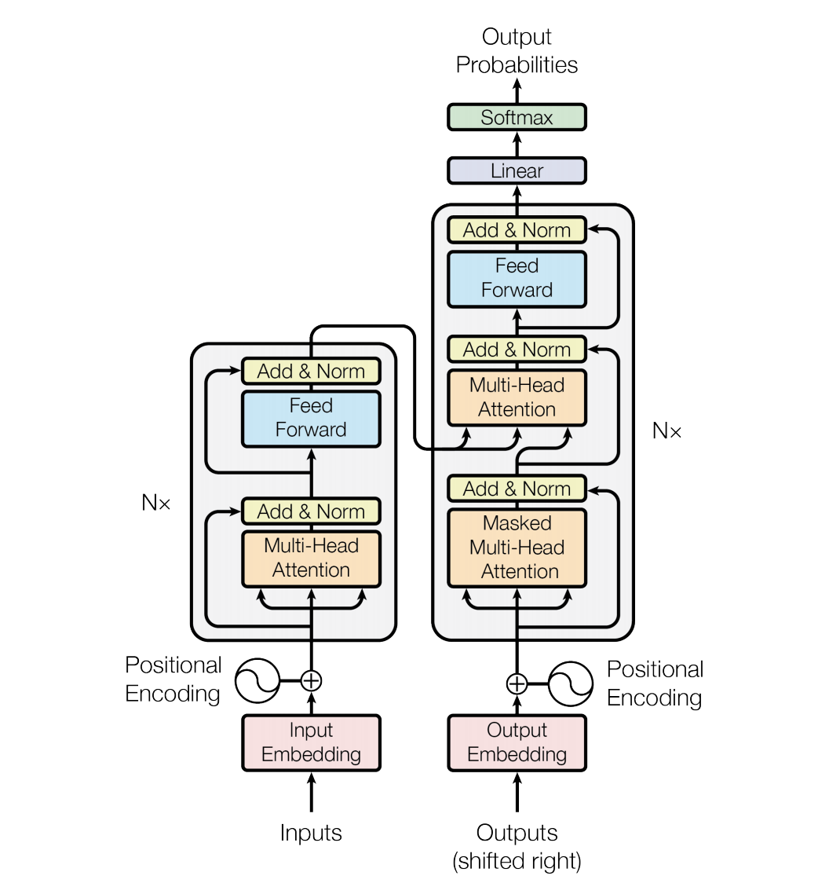

* Encoder-decoder结构
* 输入部分
  * Input embedding
  * Positional embedding
* Transformer部分
  * Attention
  * Feed forward


---

# LlaMA的模型结构


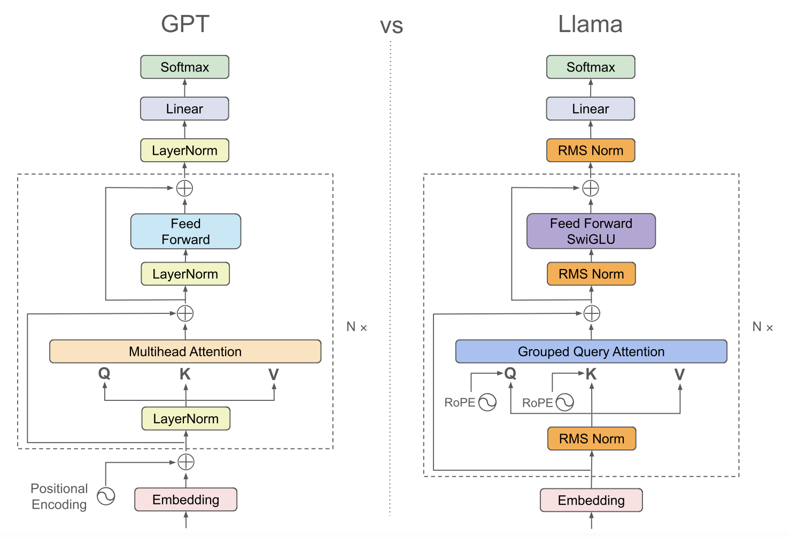

---

# HF LlaMA模型结构

```python
LlamaForCausalLM(
  (model): LlamaModel(
    (embed_tokens): Embedding(128256, 2048)
    (layers): ModuleList(
      (0-15): 16 x LlamaDecoderLayer(
        (self_attn): LlamaAttention
        (mlp): LlamaMLP
        (input_layernorm): LlamaRMSNorm
        (post_attention_layernorm): LlamaRMSNorm
    )
    (norm): LlamaRMSNorm((2048,), eps=1e-05)
    (rotary_emb): LlamaRotaryEmbedding()
  )
  (lm_head): Linear(in_features=2048, out_features=128256, bias=False)
)
```


---

# LlamaDecoderLayer内部结构

```python
(self_attn): LlamaAttention(
  (q_proj): Linear(in_features=2048, out_features=2048, bias=False)
  (k_proj): Linear(in_features=2048, out_features=512, bias=False)
  (v_proj): Linear(in_features=2048, out_features=512, bias=False)
  (o_proj): Linear(in_features=2048, out_features=2048, bias=False)
  (rotary_emb): LlamaRotaryEmbedding()
)
(mlp): LlamaMLP(
  (gate_proj): Linear(in_features=2048, out_features=8192, bias=False)
  (up_proj): Linear(in_features=2048, out_features=8192, bias=False)
  (down_proj): Linear(in_features=8192, out_features=2048, bias=False)
  (act_fn): SiLU()
)
(input_layernorm): LlamaRMSNorm((2048,), eps=1e-05)
(post_attention_layernorm): LlamaRMSNorm((2048,), eps=1e-05)
```

---

### Qwen3-0.6B模型结构

```python
Qwen3ForCausalLM(
  (model): Qwen3Model(
    (embed_tokens): Embedding(151936, 1024)
    (layers): ModuleList(
      (0-27): 28 x Qwen3DecoderLayer(
        (self_attn): Qwen3Attention()
        (mlp): Qwen3MLP()
        (input_layernorm): Qwen3RMSNorm((1024,), eps=1e-06)
        (post_attention_layernorm): Qwen3RMSNorm((1024,), eps=1e-06)
      )
    )
    (norm): Qwen3RMSNorm((1024,), eps=1e-06)
    (rotary_emb): Qwen3RotaryEmbedding()
  )
  (lm_head): Linear(in_features=1024, out_features=151936, bias=False)
)
```

---

**Qwen3Attention内部结构**
```python
(q_proj): Linear(in_features=1024, out_features=2048, bias=False)
(k_proj): Linear(in_features=1024, out_features=1024, bias=False)
(v_proj): Linear(in_features=1024, out_features=1024, bias=False)
(o_proj): Linear(in_features=2048, out_features=1024, bias=False)
(q_norm): Qwen3RMSNorm((128,), eps=1e-06)
(k_norm): Qwen3RMSNorm((128,), eps=1e-06)
```
**Qwen3MLP内部结构**
```python
(gate_proj): Linear(in_features=1024, out_features=3072, bias=False)
(up_proj): Linear(in_features=1024, out_features=3072, bias=False)
(down_proj): Linear(in_features=3072, out_features=1024, bias=False)
(act_fn): SiLU()
```


---


# 架构新进展：DeepSeek-V4.1-Flash

<style scoped>
section { padding: 32px 60px; }
h1 { font-size: 44px; margin-bottom: 12px; }
p { margin: 0; }
.source { font-size: 18px; color: #666; margin-top: 10px; }
</style>

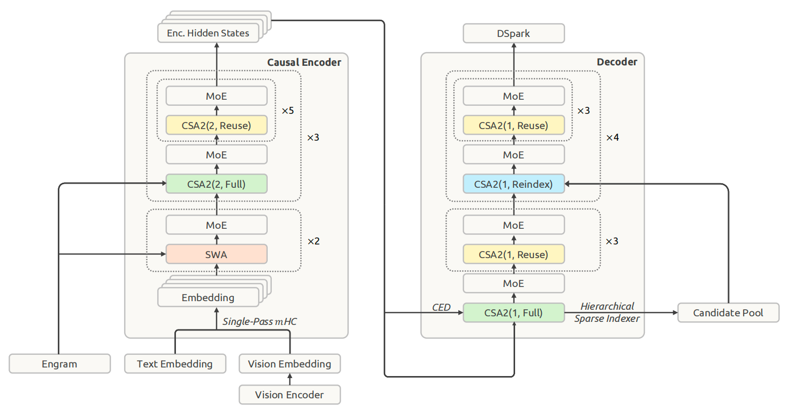

<p class="source">来源：DeepSeek-V4.1-Flash 技术报告，Figure 3，§2（架构）</p>

<!--
来源：DeepSeek-V4.1-Flash: Pushing the Limits of KV Cache Compression，Figure 3，第 7 页；§2.1–2.4。
图中的 Encoder 是因果编码器，并非经典 Transformer 的双向 Encoder。
CSA2(ratio, mode) 中，ratio 表示序列压缩率，mode 表示全局 KV 与检索索引的复用方式。
Engram 提供条件记忆，Single-Pass mHC 优化残差流混合，DSpark 用于推测解码。
此页先建立整体印象，后续课程再展开注意力、MoE 和推理优化。
-->

---

# DeepSeek-V4.1-Flash：架构要点

<style scoped>
section { font-size: 28px; line-height: 1.4; }
h1 { font-size: 44px; }
li { margin-top: 12px; }
</style>

- **CED：降低长输入的处理成本**  
  20 层因果 Encoder + 20 层 Decoder；后者的全局 KV 来自 Encoder 输出，大部分输入可跳过后半网络的完整计算。
- **CSA2：跨层复用历史信息**  
  Full 建立全局 KV，Reindex 共享 KV 并重新检索，Reuse 同时复用 KV 和所选位置；各层仍保留自己的 Q 与局部滑窗。
- **面向长上下文的组合优化**  
  分层索引缩小检索范围，FP4 压缩全局主 KV；重放末尾 128 个 token，近似恢复局部滑窗状态。

**回到本讲：文本仍先查表得到 embedding；位置关系仍需在 attention 中编码。**

<!--
来源：DeepSeek-V4.1-Flash 技术报告，§2.2–2.4、§3.2.2、§4.2.1，第 9–14、20、22 页。
Prefill 指处理输入并建立缓存，Decode 指逐 token 生成输出；KV 是注意力中缓存的 Key/Value 表示。
CED 仍需为 Decoder 准备局部 SWA KV，不能说所有输入都只经过 Encoder。
分层索引的第一次扫描仍覆盖完整历史；Bounded Replay 是近似恢复，不是数学等价重算。
-->

---

# 本次课程关注


- 目前，流行结构多为Decoder-only
- **输入部分**
  - **Input embedding**
  - **Positional embedding**
- Transformer部分
  - Attention 
  - Feed forward 


---

# 为LLM构建词汇表

* 自然语言是离散的，LLM词汇表依然延续离散的模式构建
* 如何分词: 'Hello, world!'
  * word-based: | hello | , | world | ! |
  * character-based: h|e|l|l|o|,|w|o|r|l|d|!
  * subword-based tokenization
    * 基本原则：常用“词”不拆分，一般词分解为有意义的子词(subword)
    * 来试试[Tiktokenizer](https://tiktokenizer.vercel.app/?model=meta-llama%2FMeta-Llama-3-8B)


---

# 中文、英文与混合文本

| 文本 | 常见切分特点 |
|---|---|
| 英文 `unbelievable` | 常见词整体保留，生词按词缀/子词拆分；空格和大小写也参与编码 |
| 中文 `南京大学` | 无空格边界；常见词可能整体保留，也可能按汉字或 byte 拆分 |
| 中英混合 `LLM中的embedding` | 字母、汉字、数字和标点按各自规则切分 |

<!-- ```python
for text in ["Nanjing University", "南京大学", "LLM中的embedding"]:
    print(text, tokenizer.tokenize(text))
``` -->

语言差异发生在 tokenizer 阶段；后面的 embedding 只处理统一的 token ID。token 数量会影响上下文长度、显存和推理成本。

<!-- ---

# Tokenization方式

* Byte-level BPE (GPT2)
* WordPiece (BERT)
* Unigram：另一种子词建模算法
* SentencePiece：支持 BPE、Unigram 的工具，不是与它们并列的算法

* Tokenizer in LlaMA3
  * BPE model based on [tiktoken](https://github.com/openai/tiktoken) -->


---

# 观察中英文分词

使用同一个 Qwen3 tokenizer，比较中英文和混合文本：

```python
for text in ["Nanjing University", "南京大学", "LLM中的embedding"]:
    ids = tokenizer.encode(text, add_special_tokens=False)
    print(text, tokenizer.tokenize(text), ids, len(ids))
    assert tokenizer.decode(ids) == text
```

- token 字符串可能是字节的内部表示，不一定直接可读。

---

# 批量输入：补齐与 attention mask

```python
if tokenizer.pad_token_id is None:
    tokenizer.pad_token = tokenizer.eos_token
batch = tokenizer(["你好", "南京大学"], padding=True,
                  return_tensors="pt")
print("token IDs:\n", batch["input_ids"])
print("mask:\n", batch["attention_mask"])
```

---

# 批量输入：补齐与 attention mask

Qwen3 实际输出（右侧补齐）：

```text
                  input_ids          attention_mask
你好              [108386, 151643]    [1, 0]
南京大学          [102034,  99562]    [1, 1]
```

两者形状均为 `[b, s]`。**1 是有效位置，0 是补齐位置**。
这里 `151643` 是补齐 token；0/1 mask 不能直接加到 attention 分数上。

---

# Input embedding

```python
(embed_tokens): Embedding(128256, 2048)
```

* tokenizer：将自然语言转换为 token ID
* embedding：根据 token ID 查表，得到稠密向量表示
* 每个index对应一个embedding
  * embedding需训练
* 例如：
  * 用户给LLM的输入: "你好，请介绍下南京大学"
  * LLM经过预训练的embedding: [[0.2234234,-0.28178,...], [...]]

<div style="display:contents;" data-marpit-fragment>
文本到 ID 由 tokenizer 完成；ID 到向量由 embedding 完成
</div>

<!-- ---

# 实验：查表就是选择矩阵的行

- token ID：`I: [b, s]`，整数类型 `torch.long`
- 可学习词表：`T: [v, e]`
- 输出：`E: [b, s, e]`，满足 `E[b, s] = T[I[b, s]]`

```python
I = torch.tensor([[0, 3, 3], [2, 1, 0]])
T = torch.arange(16, dtype=torch.float32).reshape(4, 4)
E = T[I]
```

同一个 ID 查出同一个向量；训练更新的是词表参数。

---

# 实验 2.1：从小词表到真实模型

本地 Qwen3-0.6B：用同一个 tokenizer 和模型权重。

```python
input_embedding = qwen.get_input_embeddings()
ids = qwen_tokenizer("南京大学", return_tensors="pt")["input_ids"]
vectors = input_embedding(ids)
```

- 先预测 `[b, s, e]`，再观察中英文的 token 数和输出形状。
- 验证 `vectors == input_embedding.weight[ids]`。
- 相同 ID 的输入向量相同；上下文信息来自后续 Transformer。
- padding 也会查表；attention mask 不会自动把输入向量清零。

---

# 实验 3：one-hot 与查表等价

```python
H = torch.nn.functional.one_hot(I, num_classes=4).to(T.dtype)
assert torch.allclose(H @ T, T[I])
```

`[b, s, v] @ [v, e] → [b, s, e]`

one-hot 用于理解数学等价性；实际查表不需要分配 `[b, s, v]`。
大词表下，这能避免大量无效的存储与运算。 -->
<!-- 
---

# A2 Task 2：模块的接口约定

- `VocabEmbedding`：词表注册为 `nn.Parameter`。
- 按 `init_mean/init_std/init_seed` 正态初始化。
- `__init__` 调用 `reset_parameters()`。
- 不修改输入 ID 的值、形状、dtype、device。
- 输出 device 跟随 ID，dtype 跟随词表。

Notebook 实验 2 给出完整课堂实现，并检查输出与输入不变性。

---

# 实验 4：词表分片

取 `v=8, world_size=2`，每个 rank 保存 `[4, e]`：

| rank | 全局 ID 区间 | 输入 `[0, 3, 4, 7]` 的局部有效索引 |
|---|---|---|
| 0 | `[0, 4)` | `[0, 3, —, —]` |
| 1 | `[4, 8)` | `[—, —, 0, 3]` |

全局 ID 减去区间起点，得到局部索引；区间外输出零向量。
局部输出仍是 `[b, s, e]`；求和恢复完整结果。

---

# A2 Task 3：初始化与验证

- 分片初始化 seed：`init_base_seed + rank`。
- 先把无效索引替换为安全索引，再查表并清零。
- 作业只计算局部结果，不要求实现通信。
- 验证时拼接这些局部词表作为完整参考表。

不能拿另一份独立随机初始化的完整词表来比较数值。
Notebook 同时验证区间边界、零填充和求和恢复。 -->

---

# Input embedding原理


"语言是文明的载体，对人类而言是这样，对LLM而言也是这样"


<div style="display:contents;" data-marpit-fragment>


这是"南京大学"


</div>

---

# Input embedding原理

这也是"南京大学"


---

# Input embedding原理

<!-- <p align="center">
  

  
</p> -->

这也是“南京大学”：南大的(部分)特征

<p align="center">
  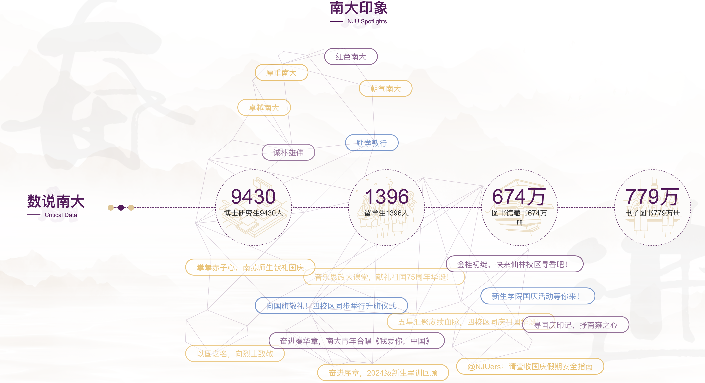
</p>

---

# Input embedding原理

**Input embedding**：构建表达自然语言**特征**的**表示 (representation)**

<p align="center">
  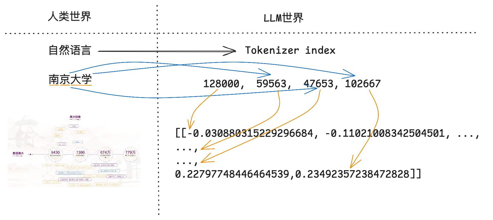
</p>

---

# 位置编码 (Positional embeddings)

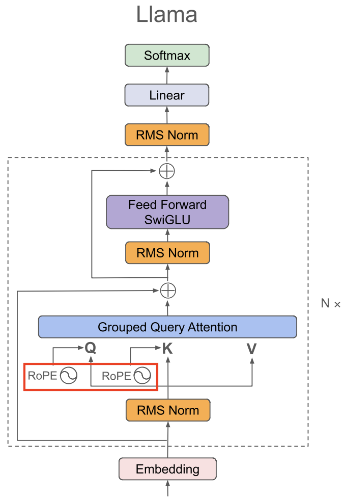

**位置编码：用来标记每个词的位置**

* Sinusoidal PE
  * Attention is all you need时代的位置编码
* Rotary PE(旋转位置编码)
  * 基于论文[RoFormer](https://arxiv.org/abs/2104.09864)

---

# 位置编码的初衷

* Attention模块计算的是每个token的注意力分数
  * 衡量token与token之间的相关性
* 位置编码用来标记每个token的位置
  * 让LLM更好的建模不同位置的token之间的关系

---

# 绝对位置编码

直接在每个token的embedding上线性叠加位置编码: $x_i + p_i$，其中$p_i$为可训练的向量

<div style="display:contents;" data-marpit-fragment>

Sinusoidal PE: Attention is all you need

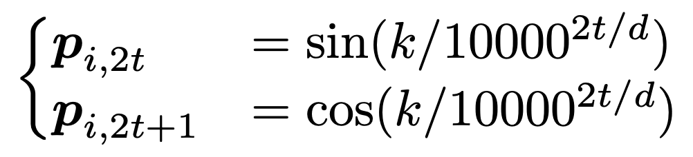

</div>

<div style="display:contents;" data-marpit-fragment>

灵感来源：通过周期性建模位置编码

</div>

---

# 位置编码与序数编码的关联

* 序数表示次序，位置编码的用意也在于此。例如从小就学的序数编码：
  * 十进制: 1 2 3 4 5 6 7 8 9 10, ...
  * 二进制: 0, 1, 10, 11, 100, 101, 110, 111, 1000, 1001, ...
* **但是**：
  * LLM中的token embedding为向量,如何构造型为向量的位置编码？

---

# 序数的周期性

十进制本身是周期性的，二进制也是周期性的

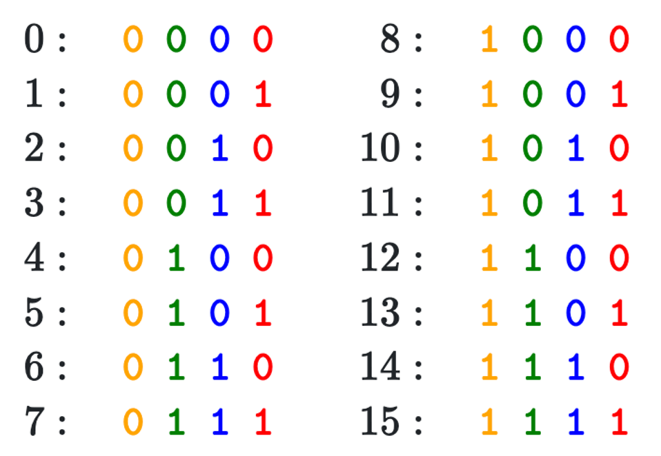


---


# Sinusodial PE

构建n维的位置编码，每一维用不同的周期函数刻画取值
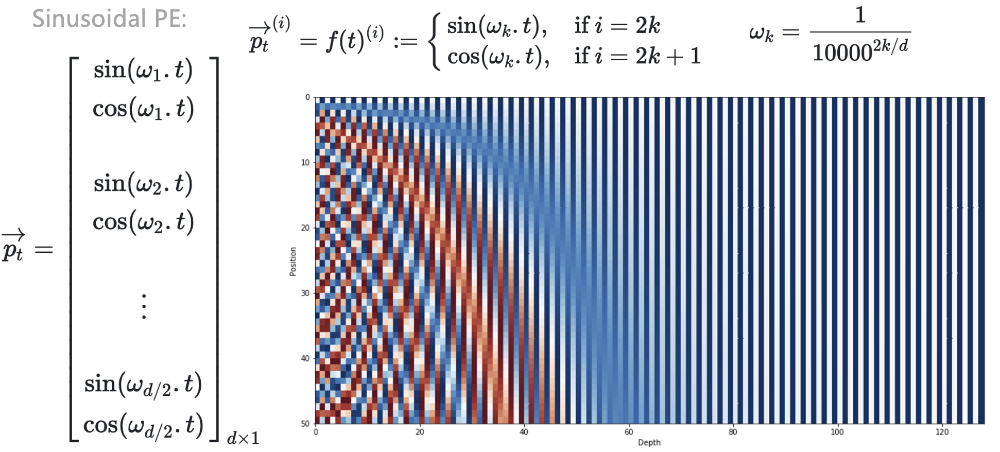


---

# 旋转位置编码（Rotary PE）


<div style="display:contents;" data-marpit-fragment>

“叠加旋转位置编码的方式由加法改乘法”

</div>

<div style="display:contents;" data-marpit-fragment>

假设两个token的embedding为$x_m$和$x_n$，$m$和$n$分别代表两个token的位置，目标找到一个等价的位置编码方式，使得下述等式成立：
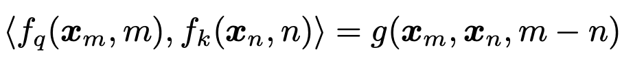

</div>

<div style="display:contents;" data-marpit-fragment>

[RoFormer](https://arxiv.org/abs/2104.09864)提出Rotary PE，在embedding维度为2的情况下：
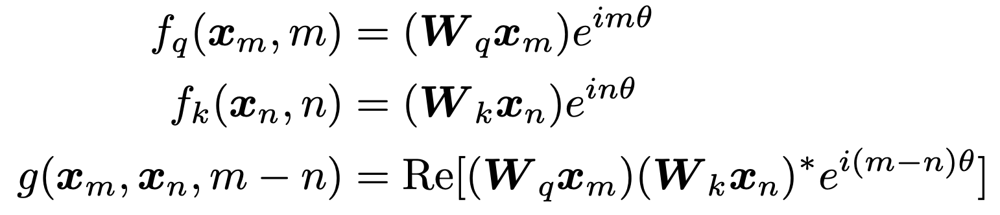

</div>

---

# Rotary PE 的 2D 理解：把向量看成箭头

先只看二维向量 $x=(x_0,x_1)$。把它画成平面上的一支箭头，位置 $n$ 不再通过加一个新向量表示，而是让箭头旋转：

$$
R(n\theta)x =
\begin{bmatrix}\cos(n\theta)&-\sin(n\theta)\
\sin(n\theta)&\cos(n\theta)\end{bmatrix}x
$$

```text
x = (1, 0), θ = 30°
位置 0：旋转 0°   → (1, 0)
位置 1：旋转 30°  → (cos 30°, sin 30°)
位置 2：旋转 60°  → (cos 60°, sin 60°)
```

---

# RoPE：位置改变方向，长度保持不变

旋转不会改变向量长度：

$$\|R(n\theta)x\|=\|x\|$$

因此，同一个 token 在不同位置有不同方向，但不会因为位置编码而改变向量的尺度。

- 位置 0：$x$
- 位置 1：$R(\theta)x$
- 位置 2：$R(2\theta)x$

---

# RoPE 为什么能表达相对位置？

设 $q$ 位于位置 $m$，$k$ 位于位置 $n$。attention 中的点积满足：

$$
(R(m\theta)q)^\top R(n\theta)k
= q^\top R((n-m)\theta)k
$$

结果只依赖位置差 $n-m$，所以 attention 可以感知两个 token 相距多远。

> RoPE 给每个位置配一个旋转角度；Q 和 K 比较旋转后的方向时，结果自然包含相对距离信息。

---

# 从二维推广到高维

高维 RoPE 将 hidden vector 的维度两两分组：$(x_0,x_1)$、$(x_2,x_3)$、……，每一对维度在自己的二维平面中旋转。

不同维度使用不同的角速度，因此同时表达短距离和长距离的位置变化。实际模型在 attention 的每一层对 **Q 和 K** 应用 RoPE。

# RoPE实现

RoPE的2D实现
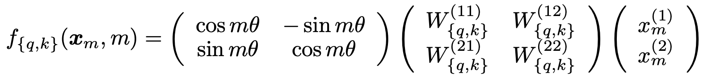

RoPE的n维实现
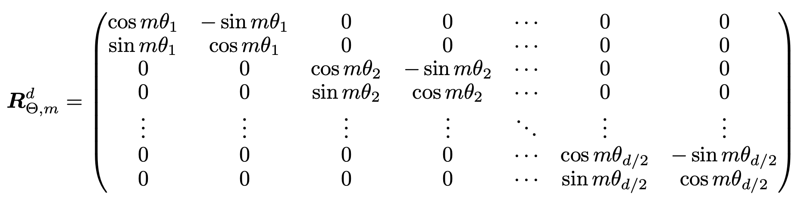


---


# Rotary PE的可视化展示

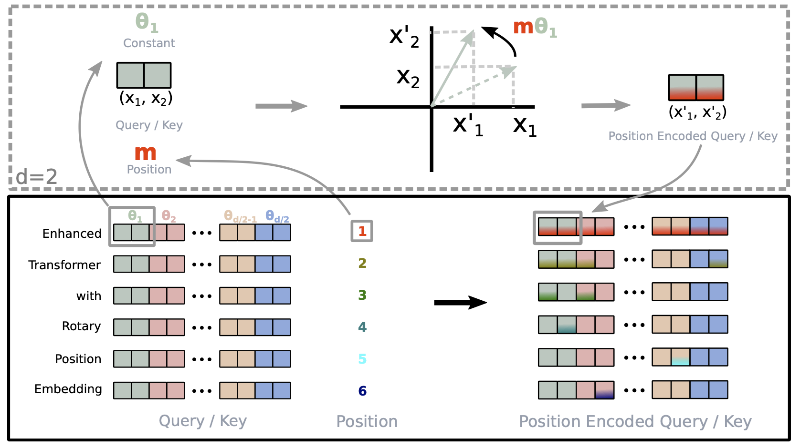


---

# RoPE在LlaMA中的构建

不同于经典Transformers结构，只对输入的token做位置编码的叠加

LlaMA中的RoPE在Transformer的每一层都会对Q和K进行位置编码的叠加


---

# 补充内容：PyTorch Tensor操作详解

在深度学习中，tensor操作是构建模型的基础。理解各种tensor操作对于实现LLM等复杂模型至关重要。

<!-- 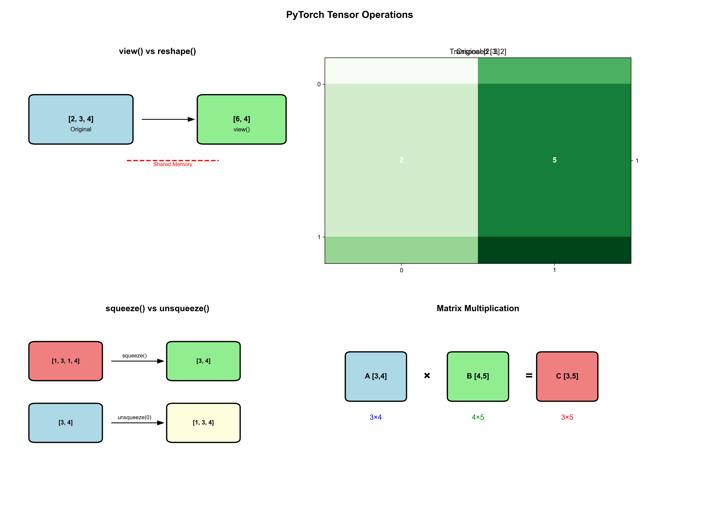 -->

---

# Tensor操作分类

* **形状变换操作**
  * `view()` / `reshape()` - 改变tensor形状
  * `transpose()` / `permute()` - 转置和维度重排
  * `squeeze()` / `unsqueeze()` - 压缩/扩展维度
* **数学运算操作**
  * `matmul()` / `@` - 矩阵乘法
  * `bmm()` - 批量矩阵乘法
  * `einsum()` - 爱因斯坦求和约定
* 存储连续：`contiguous()`


---

# Tensor操作分类

* **索引和切片操作**
  * `gather()` / `scatter()` - 按索引收集/分散
  * `index_select()` - 按索引选择
  * `masked_select()` - 按掩码选择

---

# 形状变换操作：view vs reshape

## 基本原理

* **`view()`**: 返回与原tensor共享存储的新视图，要求tensor在内存中连续
* **`reshape()`**: 如果可能则返回view，否则返回副本

---


## 代码示例

```python
# view() - 要求tensor连续
x = torch.randn(2, 3, 4)
y = x.view(6, 4)  # 成功：2*3=6

# 如果tensor不连续，view()会报错
x_transposed = x.transpose(0, 1)  # 不连续
# y = x_transposed.view(12, 2)  # 报错！

# reshape() - 自动处理连续性问题
y = x_transposed.reshape(12, 2)  # 成功：自动处理
```

---

# 转置操作：transpose vs permute

transpose() - 交换两个维度

```python
x = torch.randn(2, 3, 4, 5)
y = x.transpose(1, 3)  # 交换维度1和3
print(x.shape)  # torch.Size([2, 3, 4, 5])
print(y.shape)  # torch.Size([2, 5, 4, 3])
```
permute() - 重新排列所有维度

```python
x = torch.randn(2, 3, 4, 5)
y = x.permute(0, 3, 1, 2)  # 重新排列维度
print(x.shape)  # torch.Size([2, 3, 4, 5])
print(y.shape)  # torch.Size([2, 5, 3, 4])
```

---

# 维度操作：squeeze vs unsqueeze

squeeze() - 移除大小为1的维度

```python
x = torch.randn(1, 3, 1, 4)
y = x.squeeze()  # 移除所有大小为1的维度
z = x.squeeze(0)  # 只移除第0维
print(x.shape)  # torch.Size([1, 3, 1, 4])
print(y.shape)  # torch.Size([3, 4])
print(z.shape)  # torch.Size([3, 1, 4])
```

---
# 维度操作：squeeze vs unsqueeze

unsqueeze() - 在指定位置插入大小为1的维度

```python
x = torch.randn(3, 4)
y = x.unsqueeze(0)  # 在第0维插入
z = x.unsqueeze(-1)  # 在最后一维插入
print(x.shape)  # torch.Size([3, 4])
print(y.shape)  # torch.Size([1, 3, 4])
print(z.shape)  # torch.Size([3, 4, 1])
```

---

# Broadcasting（广播）机制

<!-- 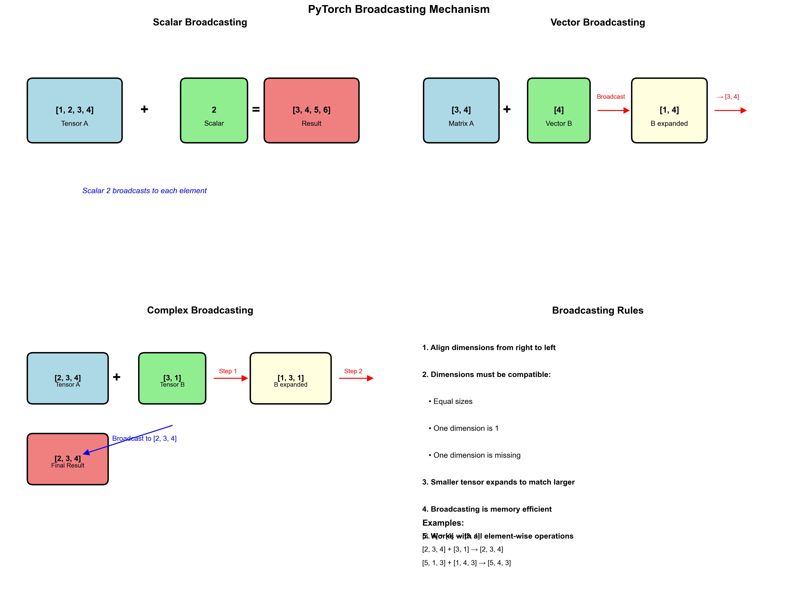 -->


Broadcasting是PyTorch中一种强大的机制，允许不同形状的tensor进行运算。它遵循以下规则：

1. **从右向左对齐维度**：从最后一个维度开始比较
2. **维度兼容性**：两个维度要么相等，要么其中一个为1，要么其中一个不存在
3. **自动扩展**：较小的tensor会在不兼容的维度上自动扩展

---

## Broadcasting规则示例

```python
# 示例1: 标量与tensor
a = torch.tensor([1, 2, 3])
b = 2
c = a + b  # [3, 4, 5] - 标量自动广播到每个元素

# 示例2: 不同形状的tensor
A = torch.randn(3, 4)      # [3, 4]
B = torch.randn(4)         # [4]
C = A + B                  # [3, 4] - B自动扩展为[1, 4]然后[3, 4]

# 示例3: 更复杂的广播
A = torch.randn(2, 3, 4)   # [2, 3, 4]
B = torch.randn(3, 1)      # [3, 1]
C = A + B                  # [2, 3, 4] - B扩展为[1, 3, 1]然后[2, 3, 4]
```

---

## Broadcasting在深度学习中的应用

```python
# 1. 添加偏置项
x = torch.randn(32, 128)  # [batch_size, features]
bias = torch.randn(128)   # [features]
y = x + bias              # 每个样本都加上相同的偏置

# 2. 注意力机制中的mask
scores = torch.randn(2, 8, 8)  # [batch, seq_len, seq_len]
mask = torch.tensor([1, 1, 1, 0, 0, 0, 0, 0])  # [seq_len]
masked_scores = scores.masked_fill(~mask.bool().view(1, 1, -1), float("-inf"))  # 广播到[2, 8, 8]

# 3. 批量归一化
x = torch.randn(32, 64, 28, 28)  # [batch, channels, height, width]
mean = torch.mean(x, dim=(0, 2, 3), keepdim=True)  # [1, 64, 1, 1]
normalized = (x - mean) / torch.std(x, dim=(0, 2, 3), keepdim=True)
```

---

# 矩阵乘法操作

不同矩阵乘法的使用场景

* **`torch.matmul()` / `@`**: 通用矩阵乘法，支持广播
* **`torch.bmm()`**: 批量矩阵乘法，专门用于3D tensor
* **`torch.mm()`**: 2D矩阵乘法

```python
# 批量矩阵乘法
A_batch = torch.randn(2, 3, 4)
B_batch = torch.randn(2, 4, 5)
C_batch = torch.bmm(A_batch, B_batch)
print(C_batch.shape)  # torch.Size([2, 3, 5])
```

---

# 爱因斯坦求和约定 (einsum)

einsum提供了一种简洁的方式来表达复杂的tensor操作：

```python
# 矩阵乘法: C[i,j] = sum_k A[i,k] * B[k,j]
A = torch.randn(3, 4)
B = torch.randn(4, 5)
C = torch.einsum('ik,kj->ij', A, B)
# 批量矩阵乘法
A_batch = torch.randn(2, 3, 4)
B_batch = torch.randn(2, 4, 5)
C_batch = torch.einsum('bik,bkj->bij', A_batch, B_batch)
# 注意力机制中的QK^T计算
Q = torch.randn(2, 8, 64)  # [batch, seq_len, d_model]
K = torch.randn(2, 8, 64)
scores = torch.einsum('bqd,bkd->bqk', Q, K)
```

---

# 索引和选择操作

gather() - 按索引收集元素

```python
# 在指定维度上按索引收集元素
x = torch.randn(3, 4)
indices = torch.tensor([0, 2, 1])
y = torch.gather(x, 1, indices.unsqueeze(1))
print(x)
print(y)  # 每行按indices选择元素
```

---

## scatter() - 按索引分散元素

```python
# 将元素分散到指定位置
x = torch.zeros(3, 4)
values = torch.randn(3, 2)
indices = torch.tensor([[0, 2], [1, 3], [0, 1]])
x.scatter_(1, indices, values)
print(x)
```

---

# 拓展阅读&参考文档

[Hugging Face](https://huggingface.co/transformers/model_doc/llama.html)
[Accelerating a Hugging Face Llama 2 and Llama 3 models with Transformer Engine](https://docs.nvidia.com/deeplearning/transformer-engine/user-guide/examples/te_llama/tutorial_accelerate_hf_llama_with_te.html)

RoPE部分
[Transformer升级之路：10、RoPE是一种β进制编码. 苏剑林](https://kexue.fm/archives/9675)
[RoFormer: Enhanced Transformer with Rotary Position Embedding](https://arxiv.org/pdf/2104.09864)

PyTorch Tensor操作
[PyTorch官方文档 - Tensor操作](https://pytorch.org/docs/stable/torch.html#tensor-operations)
[Einops库 - 更优雅的tensor操作](https://github.com/arogozhnikov/einops)
